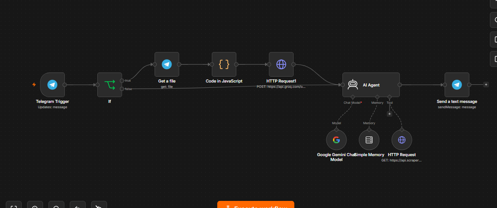
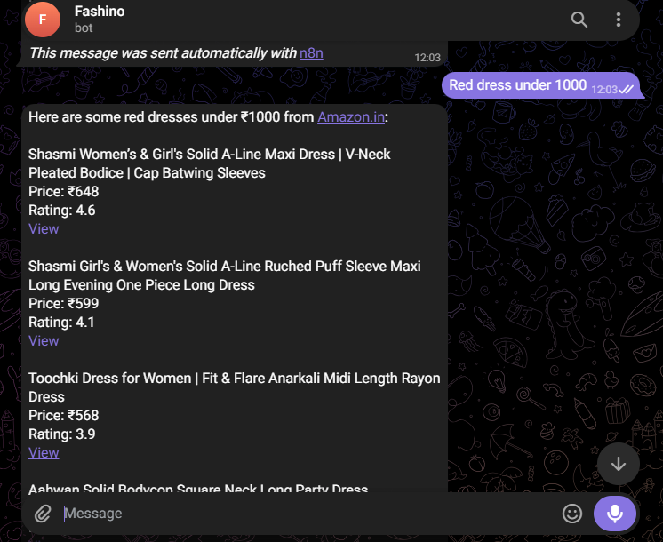

# Jafer — AI Shopping & Styling Assistant

An always-on Telegram bot that helps users search for products on Amazon India and gives personalized outfit styling advice. Built as an n8n workflow, deployed 24/7 on Railway.

## Workflow 


## Sample Output


**Live**: Runs as a Telegram bot (message-based, not a public web link)
**Stack**: n8n, Google Gemini 2.5 Flash, Groq Whisper (voice transcription), ScraperAPI, Telegram Bot API

## What it does

Jafer handles two kinds of requests from a single Telegram chat:

1. **Product search** — "show me running shoes under 2000" → scrapes Amazon India search results → returns top 5 products with name, price, rating, and link.
2. **Styling advice** — "how do I style a blue kurti?" → asks clarifying questions (occasion, color, style preference) → gives outfit + accessory suggestions, then offers to search for matching items.

It also accepts **voice messages** — these are transcribed to text before being processed, so the assistant works hands-free.

## How it works

```
Telegram message
     │
     ▼
  Is it voice?
   ├── Yes → Download file → Fix extension (.oga→.ogg) → Transcribe (Groq Whisper) ──┐
   └── No  → pass text straight through ─────────────────────────────────────────────┤
                                                                                      ▼
                                                                            AI Agent (Gemini 2.5 Flash)
                                                                            - Classifies intent (search vs. styling)
                                                                            - Calls ScraperAPI tool for product search
                                                                            - Gives styling advice conversationally
                                                                                      │
                                                                                      ▼
                                                                          Send response back via Telegram
```

### Key design choices
- **Single AI Agent node** handles both routing and response generation, guided by a detailed system prompt rather than separate branching logic — keeps the workflow simple while letting the LLM handle intent classification.
- **Voice support** required a small preprocessing step: Telegram voice notes are `.oga` files, but the Whisper API expects `.ogg`, so a Code node renames the extension before transcription.
- **Tool-use pattern**: the AI Agent calls an HTTP Request node (wrapped as an LLM tool) to scrape Amazon search results live, rather than relying on static/cached data — keeps prices and availability accurate.

## Setup

To run this workflow yourself:

1. Import `workflow.json` into your n8n instance.
2. Set up credentials for:
   - **Telegram Bot API** (create a bot via [@BotFather](https://t.me/BotFather))
   - **Google Gemini API** (Google AI Studio)
3. Replace the placeholder values in the two HTTP Request nodes:
   - `HTTP Request` node → your [ScraperAPI](https://www.scraperapi.com/) key
   - `HTTP Request1` node → your [Groq](https://console.groq.com/) API key (used for Whisper transcription)
4. Activate the workflow.

> Note: API keys in `workflow.json` are placeholder/example values only.

## Tech notes
- Amazon search results are scraped live via ScraperAPI (targets `div.s-search-results` on amazon.in) — no static/mock data.
- Deployed on [Railway](https://railway.app) for 24/7 uptime.
