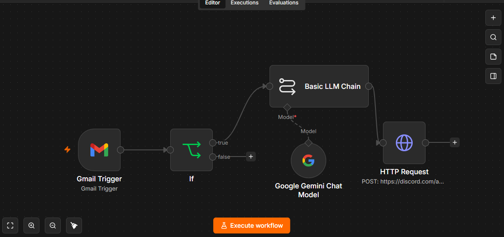
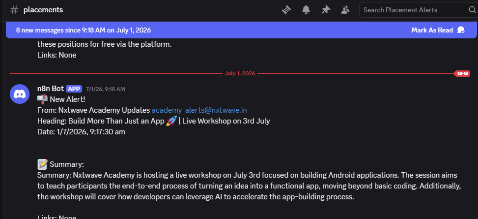

# Placement Email Alert

An automated Gmail-to-Discord pipeline that watches for placement, internship, and opportunity emails, summarizes them with an LLM, and posts a clean alert to a Discord channel — so important emails don't get buried in a crowded inbox.

**Stack**: n8n, Gmail API, Google Gemini, Discord Webhooks

## Workflow 


## Sample Output


## What it does

1. Polls Gmail every minute for new mail.
2. Filters for emails matching relevant keywords in the subject or sender — e.g. `internship`, `offer letter`, `campus drive`, `placement`, `workshop`, `opportunity`, or emails from a specific placement cell address (NxtWave).
3. Passes matching emails to Gemini, which:
   - Summarizes the email in 3-4 sentences
   - Extracts any registration links or important URLs mentioned
4. Posts a formatted alert to a Discord channel with sender, subject, timestamp, and the AI-generated summary.

## How it works

```
Gmail Trigger (polls every minute)
         │
         ▼
   Keyword filter (subject/sender match)
         │
         ▼
   Basic LLM Chain (Gemini)
   — summarizes email, extracts links
         │
         ▼
   Discord Webhook
   — posts formatted alert
```

### Key design choices
- **Keyword filtering before the LLM call** — cheaper and faster than summarizing every email; only relevant ones reach the LLM step.
- **Structured LLM output** — the prompt forces a fixed `Summary: ... / Links: ...` format, so the Discord message stays consistent and scannable regardless of how messy the original email is.
- **Discord as the notification layer** — instant push-style alerts without needing a custom app or SMS service.

## Setup

To run this workflow yourself:

1. Import `workflow.json` into your n8n instance.
2. Set up credentials for:
   - **Gmail** (OAuth2, via n8n's Gmail Trigger node)
   - **Google Gemini API** (Google AI Studio)
3. Create a Discord webhook in your target channel (Server Settings → Integrations → Webhooks → New Webhook → Copy URL).
4. Paste your webhook URL into the `HTTP Request` node's `url` field, replacing the placeholder.
5. Adjust the keyword filters in the `If` node to match your own use case (currently tuned for placement/internship alerts).
6. Activate the workflow.

> Note: The Discord webhook URL in `workflow.json` is a placeholder — replace it with your own before running.

## Tech notes
- Polling interval is set to every minute; adjust based on how time-sensitive your alerts need to be vs. API quota usage.
- The `If` node uses an OR combinator across all keyword conditions, so any single match triggers the pipeline.
